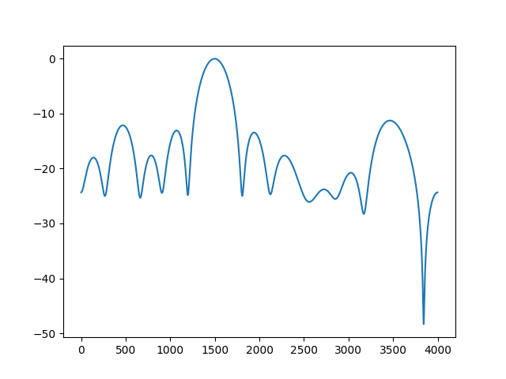
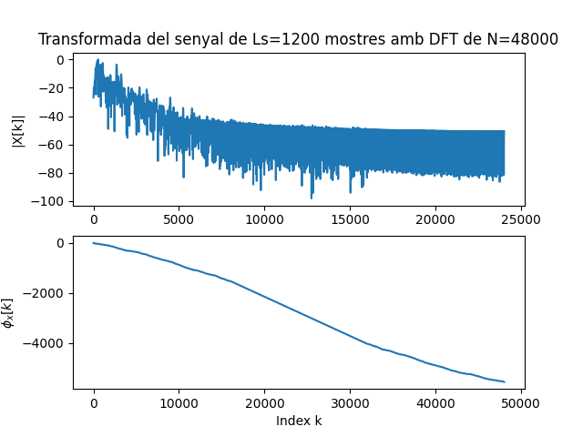

##### ORIOL GARCIA VILA
# Pràctica 1:

### EXERCICI 1: 
---
* ### fx=4KHz

Utilitzant una Fx de 4 KHz obtenim la següent representació dels 5 primers períodes:


<br>

El so es guarda en un fitxer anomenat: `so_exercic1.wav`

La seva representació en mòdul i fase és:


Podem observar com obtenim un tò molt més agut.

---
* ### fx=1500Hz

Utilitzant una Fx de 1500 Hz obtenim la següent representació dels 5 primers períodes:


El so es guarda en un fitxer anomenat: `so_exercic2.wav` 

La seva representació en mòdul i fase és:


<br>
Podem observar com obtenim un tò molt més greu que l'anterior.

#### COMENTARIS: 
Amb la freqüència de 4KHz, obtenim una representació dels 5 primers períodes en més o menys 1ms i amb uns pics molt marcats, mentre que amb la freqüència de 1500Hz en 3ms i uns pics no tant marcats.

En quant al domini transformat, amb la freqüència de 4KHz, observem una senyal sinc amb un valor de 40 de pic a 4KHz, mentre que la freüència de 1500Hz obtenim 2 sincs amb valor 50 de pic en les freqüencies 1500Hz i 6500Hz.

### EXERCICI 2:
---
En aquest exercici, utilitzo la lectura del fixer d'audio creat en l'apartat anterior el qual és un tò de 4Khz (`so_exercici1.wav`):

Llegeixo el fitxer, obtenint un array de mostres del senyal i una variable que conté el valor de la freqüència de mostratge.

```python
#LLEGIR :
x_r, fm = sf.read('so_exercici1.wav')

#Trobar freqüència del senyal:
plt.figure(0)
plt.xlabel('Hz')
magspec = plt.magnitude_spectrum(x_r, fm) 
fx = magspec[1][np.argmax(magspec[0])] 
print(f'Freqüència fonamental del senyal: {fx} Hz')
plt.show()
```

Utilitzo una funció que retorna dos arrays una amb el valor d'energia i una altre amb les freqüencies que actuen.
Per poder obtenir la frqüència fonamental del fitxer, busco la freqüència que fa que l'energia del senyal sigui màxima. 

Al ser un to de 4Khz, veiem clarament aquesta freq. representada en una gràfica que pondera les freqüències en funció de la seva energia en el fitxer:


<br>

Un cop tenim la freqüencia fonamental, podem representar els 5 primers períodes:

<br>


<br>

També el mòdul i fase de la seva TF:


#### COMENTARIS:
Podem observar que les gràfiques dels 5 períodes i la representació en domini transformat és molt semblant que l'exercici anterior, el qual generavem aquest to.

La diferència la trobem en el valor de les mostres, que s'ha vist reduït, però la forma d'ona seguiex igual.

Ara al llegir el fitxer i obtenir la freqüencia de mostratge, les mostres del senyal i obtenint la freqüencia fonamental, veiem que podem reproduir el mateix senyal que si hagués estat generat de nou, però amb un valor d'amplitud reduït.

--- 
### EXERCICI 3:
En aquest exercici represento en dB el mòdul de la transformada llegida a través del fitxer `.wav`, en aquest cas he fet servir el ditxer (`so_exercici2.wav`) que és el corresponent a un tò sinusoidal de freqüència 1500Hz.

Primer, igual que a l'exercici anterior trobo la freqüència fonamental del fitxer d'audio:


Un cop tenim la frqüencia podem representar la transformada de forma en dB:



#### COMENTARIS: 
Un cop optenim la seva freqüència fonamental, podem veure a la gràfica que té pics de ressonància en 500Hz i 3500Hz. 

En la representació en dB del mòdul de la seva transformada, podem veure els senyals sincs en les freqüències que actuen, el més marcat obviament és el de 1500Hz i llavors hi ha en 500Hz i 3500Hz, ja que son les freqüències de ressonància que hem vist a la gràfica anterior. 

Per trobar l'amplitud del senyal a partir de la transformada s'ha de fer l'aplicació inversa, és a dir:
```python
amplitud = 10**int(max(xdb)/20)
print(f'Amplitud de la senyal a partir de la transformada: {amplitud}')
```
En el meu cas, al ser el màxim 0 en la TF, el valor de l'amplitud és 10^(0/20) = 1.


---

### EXERCICI 4:

En aquest exercici creo una variable anomenada `audio` en la qual guardo el nom del fitxer d'audio a representar.

En el meu cas he utilitzat el fitxer `OASIS_dlb_mono.wav`.

Primer de tot es mostra a la terminal el nom del fitxer, la freqüència de mostratge i el nombre total de mostres d'aquest.

```python
audio = 'OASIS_dlb_mono.wav'
x_r, fm = sf.read(audio)
n_mostres = len(x_r)
print(f'''
    Del Fitxer {audio}: 
    - Freqüència de mostratge: {fm} Hz
    - Nombre de mostres: {n_mostres}
    ''')

```
Aleshores, per representar 25ms he escollit un moment de la cançó en la qual no hi hagi silenci, per tal de representar senyal. en el meu cas he representat des del segon 10 fins al 10.025:


Seguidament represento en el domini trasnformat en dB:


 
<br>

A tot això, després de mostrar la frqüència de mostratge i el nombre de mostres, la canço comença a sonar.
Un cop es tanca la gràfica de la TF apareix una finestra que he fet amb la llibreria tkinter´, que ens permet seguir escoltant la canço fins a apretar un botó que tanca la finestra i finalitza el programa, per tant deixa de sonar.
Bàsicament la finestra serveix per mantenir obert el programa i poder seguir escoltant la canaçó.
 
 
```python
window = tkinter.Tk()
def close():
    window.quit()

L1 = ttk.Label(window, text = 'Cierra para dejar de escuchar la canción ', font='comic_sans')
L1.grid(column=0, row=1, padx=20, pady=20)

exit = ttk.Button(window, text='Close', command=close)
exit.grid(column=0, row=2, padx=15, pady=15)
window.mainloop()
```


#### COMENTARIS:
podem observar que les freqüències més importants són les que estàn representades per sobre de -20dB que vindrien a ser  les frqüències fins a 3KHz aproximadament.


