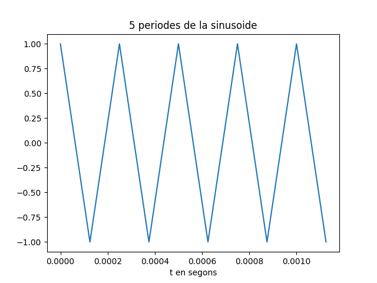

##### ORIOL GARCIA VILA
# Pràctica 1:

### EXERCICI 1: 
---
* ### fx=4KHz

Utilitzant una Fx de 4 KHz obtenim la següent representació dels 5 primers períodes:


<br>

El so es guarda en un fitxer anomenat: "so_exercic1.wav"

La seva representació en mòdul i fase és:


Podem observar com obtenim un tò molt més agut.

---
* ### fx=1500Hz

Utilitzant una Fx de 1500 Hz obtenim la següent representació dels 5 primers períodes:


El so es guarda en un fitxer anomenat: "so_exercic2.wav"

La seva representació en mòdul i fase és:


<br>
Podem observar com obtenim un tò molt més greu que l'anterior.

### EXERCICI 2:
---
En aquest exercici, utilitzo la lectura del fixer d'audio creat en l'apartat anterior el qual és un tò de 4Khz ('so_exercici1.wav'):

Llegeixo el fitxer, obtenint un array de mostres del senyal i una variable que conté el valor de la frqüència de mostratge.

```python
#LLEGIR :
x_r, fm = sf.read('so_exercici1.wav')

#Trobar freqüència del senyal:
plt.figure(0)
plt.xlabel('Hz')
magspec = plt.magnitude_spectrum(x_r, fm) 
fx = magspec[1][np.argmax(magspec[0])] 
print(f'Freqüència fonamental del senyal: {fx} Hz')
plt.show()
```

Utilitzo una funció que retorna dos arrays una amb el valor d'energia i una altre amb les freqüencies que actuen.
Per poder obtenir la frqüència fonamental del fitxer, busco la freqüència que fa que l'energia del senyal sigui màxima. 

Al ser un to de 4Khz, veiem clarament aquesta freq. representada en una gràfica que pondera les freqüències en funció de la seva energia en el fitxer:


<br>

Un cop tenim la freüencia fonamental, podem representar els 5 primers períodes:

<br>



<br>

També el mòdul i fase de la seva TF:


Podem observar que les gràfiques dels 5 períodes i la representació en domini transformat és exactament igual que en l'exercici anterior, el qual generavem aquest to.
Ara al llegir el fitxer i obtenir el 